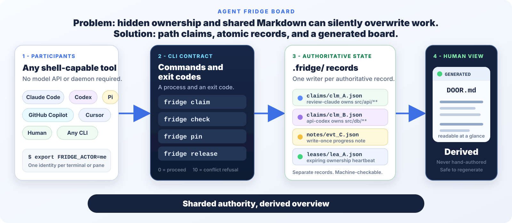

# Collaborating with Agent Fridge

This guide is for teams using Agent Fridge in a real project: humans, coding
agents, terminal panes, and automation working at the same time.

[CONTRIBUTING.md](CONTRIBUTING.md) is different. It explains how to change
Agent Fridge itself, including its two implementations and protocol tests.


*Illustrative workspace: four participants use one checkout and one generated
board. The paths, actors, project, and pull requests are fictional.*

---

## Two-minute team setup

Run this once from the project checkout. If the repository already contains
`.fridge/`, skip `fridge init`.

```bash
fridge init
fridge adapters install --vendor agents,claude,copilot,codex,cursor,generic
fridge doctor
```

Commit the setup files reported by `git status`. `fridge init` installs the
generic `AGENTS.md` instructions. The adapter command also prepares the native
instruction files for Claude Code, GitHub Copilot, Codex, Cursor, and tools such
as Pi that read `AGENTS.md`.

Then give every active terminal a unique actor name. This is one copy-paste line
per terminal:

```bash
export FRIDGE_ACTOR=review-claude && fridge join --agent "$FRIDGE_ACTOR" --vendor claude
```

PowerShell:

```powershell
$env:FRIDGE_ACTOR = "review-claude"; fridge join --agent $env:FRIDGE_ACTOR --vendor claude
```

Use a different actor name in every terminal, even when two terminals use the
same vendor. Verify the identity with:

```bash
fridge whoami
```

The team is ready when every terminal can run `fridge board` and see the same
checkout-level board.

---

## The operating loop

Every participant follows the same loop.

### 1. Join

Set a unique `FRIDGE_ACTOR`, then join once for that terminal's working
session:

```bash
export FRIDGE_ACTOR=api-codex && fridge join --agent "$FRIDGE_ACTOR" --vendor codex
```

### 2. Read the board

Read active claims and handoff offers before choosing work:

```bash
fridge board
fridge inbox
```

### 3. Claim narrow paths

Claim only the files or smallest glob needed for the task:

```bash
fridge claim "src/api/orders/**" --task "Build order API for PR #42" --ttl 30m
```

Avoid claiming `src/**` when one module or file is enough. Narrow claims let
unrelated work continue.

### 4. Check before expanding scope

Before touching a file outside the original plan, check it:

```bash
fridge check src/db/order-schema.sql --for-write
```

- Exit `0`: your existing claim covers the path.
- Exit `10`: another participant has an overlapping claim. Stop.
- Exit `14`: the path is outside your claims. Claim it before editing.

`fridge check` does not expand a claim. If the path is unclaimed, take a second
narrow claim:

```bash
fridge claim "src/db/order-schema.sql" --task "Add order status column" --ttl 30m
```

### 5. Pin progress

Publish durable progress without editing a shared status file:

```bash
fridge pin "PR #42: order endpoint implemented; focused API tests pass"
```

Each note is a separate write-once record. The readable board is generated from
the records.

### 6. Heartbeat

Renew leases during long work:

```bash
fridge heartbeat
```

Normal owner commands also renew leases after half their TTL. Use an explicit
heartbeat before a long think, build, or review period with no other Agent
Fridge commands.

### 7. Handoff or release

Offer unfinished work to a named participant:

```bash
fridge handoff clm_... --to docs-pi --note "implementation done; release notes remain"
```

The current owner keeps the claim until the recipient runs:

```bash
fridge inbox
fridge accept msg_...
```

If the work is complete, release it:

```bash
fridge release clm_... --outcome done --note "order endpoint and tests complete"
```



*Every participant writes its own authoritative records. `DOOR.md` is a
generated overview, not shared writable state.*

---

## Roles and identity examples

Agent Fridge does not assign jobs by vendor. These are useful examples, not
restrictions.

| Participant | Example actor and vendor | Example role |
| --- | --- | --- |
| Claude Code | `review-claude`, vendor `claude` | Review a pull request, trace behavior, or add focused review tests |
| GitHub Copilot | `design-copilot`, vendor `copilot` | Draft product flows, UI copy, or implementation notes |
| OpenAI Codex | `api-codex`, vendor `codex` | Implement a bounded module and its tests |
| Pi | `release-pi`, vendor `other` | Prepare documentation, release notes, and verification evidence |
| Cursor | `ui-cursor`, vendor `cursor` | Edit a narrow frontend component or interaction |
| Human | `riley-human`, vendor `human` | Integrate, review risk, coordinate handoffs, and authorize force operations |

One-line setup examples:

```bash
export FRIDGE_ACTOR=review-claude && fridge join --agent "$FRIDGE_ACTOR" --vendor claude
export FRIDGE_ACTOR=design-copilot && fridge join --agent "$FRIDGE_ACTOR" --vendor copilot
export FRIDGE_ACTOR=api-codex && fridge join --agent "$FRIDGE_ACTOR" --vendor codex
export FRIDGE_ACTOR=release-pi && fridge join --agent "$FRIDGE_ACTOR" --vendor other
export FRIDGE_ACTOR=ui-cursor && fridge join --agent "$FRIDGE_ACTOR" --vendor cursor
export FRIDGE_ACTOR=riley-human && fridge join --agent "$FRIDGE_ACTOR" --vendor human
```

Pi uses vendor `other` because that is the current CLI vendor value for generic
shell-capable tools. Its actor name still makes the participant clear on the
board.

---

## A realistic four-lane workspace

**Topology:** all four panes below use one physical checkout on one machine and
one checked-out integration branch. They share one live `.fridge/` directory.
The PR numbers are work references, not four simultaneously checked-out local
branches. The review lane can inspect remote PR state with `gh pr diff` without
switching branches.

| Lane | Actor | Exact claim | Work and state |
| --- | --- | --- | --- |
| PR review | `review-claude` | `fridge claim "src/checkout/**" --mode shared --task "Review PR #41; read only"` | Reviews remote PR #41 and runs local read-only checks |
| Product/design | `design-copilot` | `fridge claim "docs/checkout-flow.md" --task "Design checkout flow"` | Writes the current integration branch's flow document |
| Implementation | `api-codex` | `fridge claim "src/api/orders/**" --task "Build API for PR #42"` | Implements and tests the order API |
| Docs/release | `release-pi` | `fridge claim "docs/release/**" --task "Prepare docs and release for PR #43"` | Writes release material and evidence |

The `shared` review claim is a checkout-level coordination record, not a lock
on GitHub PR #41. A reviewer that only reads remote PR state and does not need
local checkout coordination can skip the claim. Remote PR assignment is
outside Agent Fridge.

Suppose `api-codex` decides to add API details to the design file:

```bash
fridge claim "docs/checkout-flow.md" --task "Add order API details"
```

That command exits `10` because `design-copilot` owns the path. `api-codex`
does not edit the file. It continues on `src/api/orders/**`, waits, or asks
`design-copilot` to offer a handoff.

This one-checkout layout is ideal for Herdr, tmux, or several plain terminals
when all participants need the same uncommitted working tree. It is not a
substitute for separate branches or worktrees when each lane must produce an
independent pull request. See the multi-PR recipe below.

---

## Conflict etiquette

Exit `10` means **stop before writing**. It is a coordination result, not a
warning to ignore.

Use this order:

1. Run `fridge board` and read the owner, task, scope, and lease.
2. Narrow your requested paths.
3. Do a genuinely read-only task, using `--mode shared` only when appropriate.
4. Wait with `fridge wait <claim-id> --timeout 10m`.
5. Ask the owner to offer a handoff. Only the current owner can run
   `fridge handoff`; a requester can pin a note or contact the owner.
6. If the lease is expired, follow the stale recovery process below.

Do not use `--force` to resolve ordinary contention. Do not edit around the
claim. Do not hand-edit `.fridge/` or `.fridge/DOOR.md`.

---

## The handoff contract

A useful handoff tells the next participant:

1. **What changed:** behavior and important implementation choices.
2. **Proof:** tests, builds, lint, screenshots, or commands already run.
3. **Remaining work:** the next concrete steps.
4. **Risks:** uncertainty, flaky checks, migration concerns, or edge cases.
5. **Affected paths:** exact files or narrow globs.
6. **Work link:** the relevant pull request or issue.

Pin the detailed record, then offer the live claim:

```bash
fridge pin "HANDOFF PR #42: changed order validation; proof: focused API tests pass; remaining: retry test and docs; risk: timeout path unverified; paths: src/api/orders/**; link: https://github.com/example/shop/pull/42"
fridge handoff clm_... --to docs-pi --note "PR #42; tests pass; retry test and docs remain; see latest HANDOFF note"
```

The recipient reads the board, inbox, local diff, and proof before accepting:

```bash
fridge inbox
fridge accept msg_...
```

Ownership never disappears between offer and acceptance. Declining returns the
claim to the original owner.

---

## Crash and stale lease recovery

Claims are leases, not permanent locks. The default lease is 15 minutes.
Heartbeats and normal owner commands renew it.

If a participant crashes:

1. Read `fridge board` and check the lease deadline.
2. Contact the participant if possible.
3. Preview stale cleanup:

   ```bash
   fridge reap --dry-run
   ```

4. Sweep claims that are stale:

   ```bash
   fridge reap
   ```

5. Claim the now-free narrow paths and pin what happened.

A crashed participant normally cannot block the checkout longer than its TTL
plus the one-minute grace period. Every expiry is recorded as a note.

### Who may use force

Only a human operator should decide to use force. An agent may execute a force
command only after a human explicitly directs that exact action.

- `fridge reap --force` removes an already expired claim before normal stale
  handling would remove it.
- `fridge release <claim-id> --force` can remove another participant's claim,
  including a live one.
- A claim from another host additionally requires `--allow-multihost`, because
  this machine cannot verify the remote participant's liveness.

Before force, the human verifies the owner is stopped, records the reason, and
checks for uncommitted work. Force is an audited recovery action, never a way to
win a race.

---

## Multiple terminals and orchestrators

### Plain shells

Open one shell per participant and run one identity line in each:

```bash
export FRIDGE_ACTOR=review-claude && fridge join --agent "$FRIDGE_ACTOR" --vendor claude
```

If a shell cannot keep environment variables, pass `--agent <name>` on every
command.

### tmux

Set identity in each pane, then keep a separate board pane:

```bash
tmux send-keys -t agents:0 'export FRIDGE_ACTOR=review-claude && fridge join --agent "$FRIDGE_ACTOR" --vendor claude' C-m
tmux send-keys -t agents:1 'export FRIDGE_ACTOR=api-codex && fridge join --agent "$FRIDGE_ACTOR" --vendor codex' C-m
fridge status --watch --interval 2000
```

The complete three-pane script is in [docs/interop.md](docs/interop.md).

### Herdr and similar orchestrators

Give every spawned pane or process a distinct `FRIDGE_ACTOR`. Have its bootstrap
run the same one-line join command before the agent begins. A supervisor can
read `fridge status --json` and `fridge log --json` without joining.

Do not reuse one actor name for several independently operating workers. Actor
names are the protocol's identity boundary.

### PowerShell

Use one line per terminal:

```powershell
$env:FRIDGE_ACTOR = "design-copilot"; fridge join --agent $env:FRIDGE_ACTOR --vendor copilot
```

Check numeric results with `$LASTEXITCODE`:

```powershell
fridge claim "docs/checkout-flow.md" --task "Design checkout flow"
$code = $LASTEXITCODE
if ($code -eq 10) { Write-Host "Stop: another participant owns this path" }
if ($code -ne 0 -and $code -ne 10) { exit $code }
```

---

## Checkout topology: what is protected today

Agent Fridge has no daemon or cloud registry. Live authority is stored in the
`.fridge/` directory of one working checkout.

| Topology | What Agent Fridge protects | Current limitation |
| --- | --- | --- |
| Same checkout, same machine | All cooperating terminals see the same claims, leases, inbox, notes, and generated board. Overlapping local writes are refused before editing. | Advisory coordination only. A process that ignores exit `10` can still write. Agent Fridge does not isolate the Git index or branch. |
| Separate Git worktrees | It protects participants sharing each individual worktree. Worktrees already provide physical file isolation from one another. | Live claims are not shared across worktrees. Agent Fridge cannot prevent duplicate work or later merge conflicts between them. |
| Separate clones | It protects participants sharing each individual clone. | Clones have independent `.fridge/` state. There is no cross-clone claim visibility; coordinate through GitHub, issues, or another shared system. |
| Remote PR state only | No local path protection is needed for a read-only `gh pr view` or `gh pr diff`. | Agent Fridge does not claim GitHub PRs, issues, branches, or remote files. Claim local paths only when the lane writes in its active checkout. |
| Two machines mounting one checkout | The state files are physically visible to both machines. | This is degraded. Cross-host liveness and network filesystem atomicity are weaker. Prefer one host, SSH into it, or use separate clones. |

Committed notes and actor records can later merge through Git, but they are
history, not a live cross-worktree or cross-clone coordination channel. Claims,
leases, sessions, inboxes, queues, and locks are machine-local live state and
are intentionally ignored by Git.

**Current limitation:** there is no supported global board spanning multiple
worktrees, clones, or machines. Do not infer cross-worktree ownership from one
worktree's `fridge board`.

---

## A truthful multi-PR recipe

Use one Git worktree per independent pull request. This gives each PR its own
branch and index. Use Agent Fridge inside a worktree only when several people or
agents share that worktree.

First commit the Agent Fridge setup on a common base branch. Then:

For new branches based on `main`:

```bash
git worktree add -b review/pr-41 ../shop-pr41 main
git worktree add -b feature/pr-42 ../shop-pr42 main
git worktree add -b docs/pr-43 ../shop-pr43 main
```

Assign the PR lanes in GitHub, an issue, or a human-owned plan. That assignment
is necessary because claims do not cross worktrees.

Inside the PR #42 worktree, for example:

```bash
cd ../shop-pr42
export FRIDGE_ACTOR=api-codex && fridge join --agent "$FRIDGE_ACTOR" --vendor codex
fridge claim "src/api/orders/**" --task "Implement PR #42" --ttl 30m
```

If a second participant helps in `shop-pr42`, it joins that same worktree with
a different actor and uses the same board. The PR #41 and PR #43 worktrees have
their own boards and cannot see this claim.

For a read-only review, inspect remote state without switching the worktree:

```bash
gh pr view 41
gh pr diff 41
```

When each branch is ready, commit and open its PR from its own worktree. Git and
GitHub handle cross-PR integration and merge conflicts.

Do not try to create independent PR branches concurrently from one shared
checkout. One checkout has one `HEAD` and one index. If the team intentionally
uses one integration checkout instead, designate one human integrator to own
branch switches, staging, and commits. Agent Fridge protects path cooperation;
it does not partition Git operations.

---

## Copyable collaboration checklist

```text
## Agent Fridge collaboration contract

- Declare the topology first: same checkout, worktrees, clones, or remote-only review.
- In a shared checkout, use one unique FRIDGE_ACTOR per terminal and run fridge join.
- Read fridge board and fridge inbox before choosing work.
- Claim the narrowest writable paths before editing.
- Run fridge check before touching any path outside the original scope.
- Exit 10 means stop. Never force, bypass, or edit around another claim.
- Narrow the scope, wait, or ask the owner to offer a handoff.
- Pin progress and proof as write-once notes; never edit a shared status file.
- Heartbeat during long work and release claims immediately when done.
- A handoff includes changes, proof, remaining work, risks, paths, and a PR or issue link.
- Only a human operator may authorize force recovery.
- Claims do not cross worktrees or clones. Use GitHub or a human plan for those boundaries.
- Never hand-edit .fridge/ or .fridge/DOOR.md.
```

---

## Related documentation

- [README](README.md) - problem, solution, install, and one-minute overview.
- [Quickstart](docs/quickstart.md) - complete two-terminal walkthrough.
- [Adapters](docs/adapters.md) - install collaboration rules for agent tools.
- [Interop](docs/interop.md) - tmux, Herdr, PowerShell, CI, containers, and
  degraded filesystems.
- [Protocol](spec/protocol-v0.1.md) - normative `wcp/0.1` behavior.
- [CONTRIBUTING](CONTRIBUTING.md) - change Agent Fridge itself.
- [SECURITY](SECURITY.md) - trust boundary and private vulnerability reporting.
- [CODE_OF_CONDUCT](CODE_OF_CONDUCT.md) - expectations for project
  participation.
