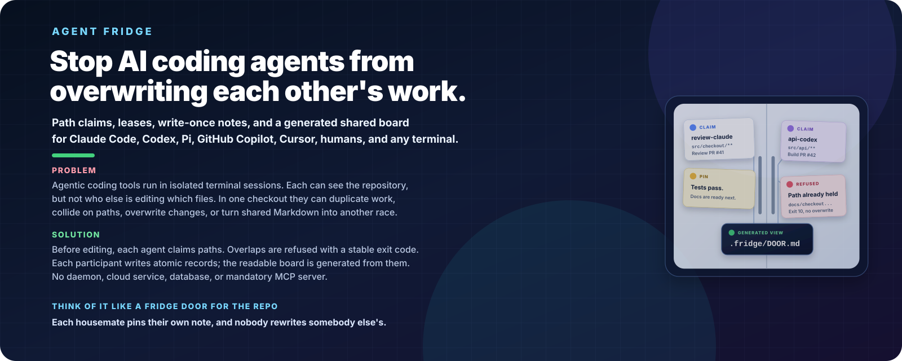
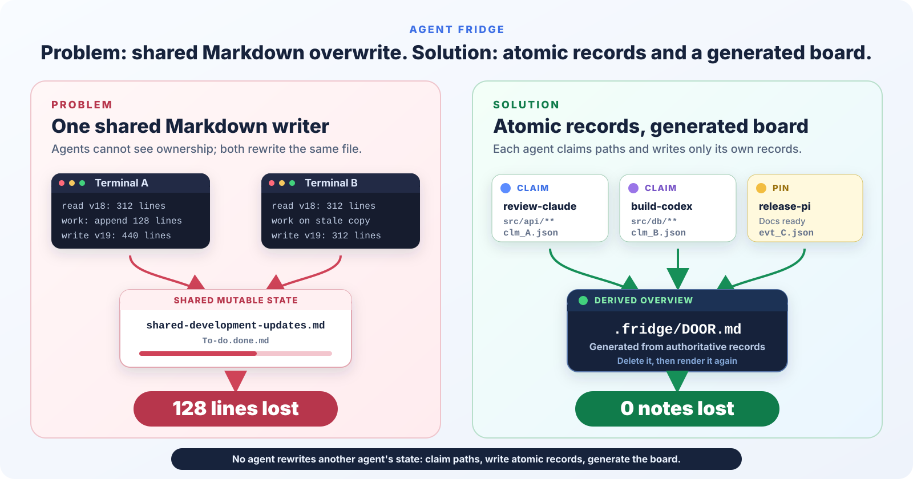
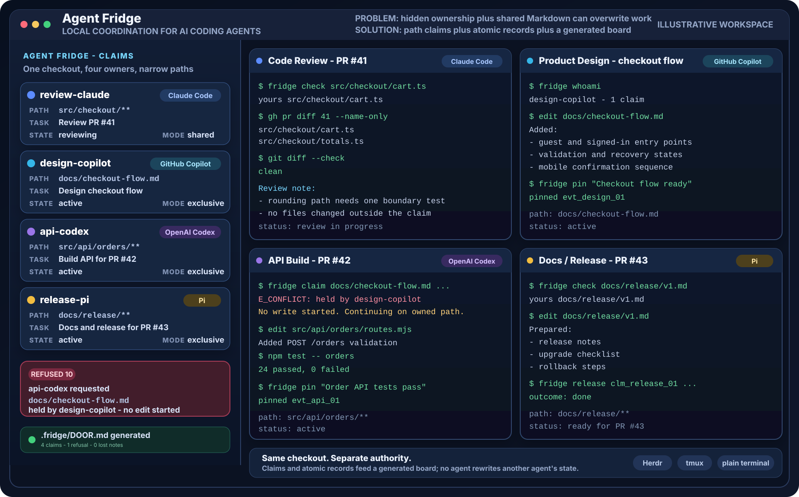

# Agent Fridge

### Stop AI coding agents from overwriting each other's work.

<p align="center">
  
</p>

**One repository-level coordination layer across agent harnesses.** Local path
claims, leases, stable conflict exit codes, write-once per-participant records,
and a generated shared board for Claude Code, Codex, GitHub Copilot, Cursor,
humans, and any terminal.

<p align="center">
  <a href="https://ragnarpitla.github.io/agent-fridge/"><strong>Read the visual story -&gt;</strong></a>
  &nbsp;&nbsp;|&nbsp;&nbsp;
  <a href="#60-second-quick-start">60-second quickstart</a>
</p>

[](https://github.com/RagnarPitla/agent-fridge/actions/workflows/ci.yml)
[](LICENSE)
[](package.json)
[](package.json)

## The problem

Run two coding agents - or two multi-agent harnesses - in one checkout and two
things break at once.

**Each harness coordinates only its own room.** An agent-team harness can keep
its spawned lead, reviewer, builder, and tester aligned through an internal
task board. A second harness in another terminal has a different board and
cannot see the first. Claude Code, GitHub Copilot, Codex, IDE agents, tmux
panes, and humans can therefore each be internally coordinated while still
colliding at the checkout boundary.

**Agents can see the repository. They cannot see path ownership.** Agentic
coding tools run in isolated terminal sessions. Claude Code in one terminal can
read every file, but has no idea that Copilot CLI in another is halfway through
rewriting `src/api/`. Nothing in Git, and nothing in either agent's context,
says "somebody is already on this." Agents in the same checkout therefore
duplicate work, collide on paths, and overwrite each other's changes.

**The usual fix is itself a race.** The standard workaround is a shared Markdown
file - `STATUS.md`, `shared-development-updates.md`, a to-do list - that every
agent reads and rewrites. Coordinating through one shared writer is
read-modify-write with concurrent writers, which loses work by construction. Agent B reads the file, works for ten
minutes, writes its version back, and everything Agent A wrote in between is
gone. This is not hypothetical: it is [the incident this project exists because
of](#the-actual-failure-this-prevents), where about 128 lines had to be
reconstructed by hand.

## The solution

Agent Fridge adds a local coordination layer. Before editing, each agent claims
the paths it needs. Overlaps are refused with a stable exit code. Each
participant writes its own records, and the readable board is generated from
them, so no two processes ever write to the same place:

| | What it gives you | Command |
| --- | --- | --- |
| **Atomic path claims** | Exclusive ownership of a set of paths, contested at exactly one resource. Two agents cannot both hold `src/api/**`, or a glob that could ever collide with it. Overlaps are refused with a stable exit code. | `fridge claim "src/api/**" --task "refactor"` |
| **Leases** | A claim expires on a clock. A crashed or forgotten agent releases its work automatically instead of blocking the repo forever. | `fridge heartbeat` |
| **Write-once notes** | Durable history as one immutable file per event. Nothing is ever rewritten, so nothing can be overwritten. | `fridge pin "deploy is flaky today"` |
| **Handoffs** | Ownership moves deliberately, with an offer the other side accepts or declines. Work is never simply abandoned. | `fridge handoff <card> --to codex` |
| **A generated board** | One human-readable page rendered *from* the records. Read it, never edit it, and it can never be the thing you lose. | `fridge board` |

**Sharded authority, derived overview.** Every authoritative write goes to a
record only one session owns, or is contested at exactly one named resource.
There is no global mutable ledger, so there is nothing for two agents to
overwrite. The readable board is generated from those records, never edited.

Local-first. Single native binary, no runtime. Works with any agent or person
that can run a command. No daemon, cloud service, database, or mandatory MCP
server.

Once that is in place, the way it behaves has a name everybody already knows:
[a fridge door for the repo](#the-fridge-door-story).

## What it solves, and what it does not

**What it solves**

- Two agents editing the same files at the same time without knowing it.
- Lost updates from read-modify-write on a shared Markdown status file.
- A crashed or abandoned agent holding work hostage indefinitely.
- "Who is doing what right now?" needing a human to go and ask.
- Durable, greppable history of what each agent did and why.
- Handing work between agents, or between an agent and a human, on purpose.
- Coordination that survives across vendors, terminals and operating systems,
  because the state is plain files in the repo rather than any one tool's memory.

**What it does not solve**

- **It is not a security boundary.** Any process that can write to the checkout
  can write to `.fridge/`. This is coordination between cooperating parties, in
  the same way a fridge door does not stop anybody from eating your lunch. See
  [SECURITY.md](SECURITY.md) and
  [the threat model](spec/protocol-v0.1.md#12-security-and-trust-boundaries).
- **It cannot stop an agent that ignores claims.** Coordination is cooperative
  and advisory. Nothing stops an agent from editing a file it has not claimed;
  Agent Fridge makes ownership *visible and checkable*, and the agents still
  have to check. Use `fridge run` to make that automatic for a command.
- **It is not a merge tool.** It prevents the collision; it does not resolve one
  that already happened. It does not replace Git branches, worktrees, reviews,
  or merge-conflict resolution.
- **It is not a scheduler or a task queue.** It does not decide who should do
  what, or in what order. It records who has taken what.
- **It is not distributed.** One checkout on one filesystem. No network lock
  service, no shared state between machines, no cloud service.
- **It does not need, or provide, a daemon.** Nothing runs in the background, so
  nothing is coordinating while your terminals are closed.

---

## See it in one minute

<p align="center">
  
</p>

The original failure was a read-modify-write collision on shared Markdown.
Agent Fridge replaces that shared writer with path claims and atomic
per-agent records, then generates the shared overview.

<p align="center">
  
</p>

This sanitized, illustrative workspace shows a realistic day: one agent reviews
PR #41, one designs the checkout flow, one builds the API for PR #42, and one
prepares docs and release work for PR #43. They share one checkout while narrow
claims stop path collisions before editing begins. The same pattern works in
Herdr, tmux, or plain terminals.

[Read the GitHub Pages article](https://ragnarpitla.github.io/agent-fridge/) |
[Open the self-contained visual story](docs/assets/visual-story.html) |
[Run the reproducible before/after demo](#the-actual-failure-this-prevents) |
[Follow the two-terminal quickstart](docs/quickstart.md)

---

## The fridge-door story

The engineering problem above comes first. The fridge door is the memorable
mental model for how the solution behaves.

The fridge door is where a household coordinates. It works because of a few
unwritten rules that everybody already understands:

- **Everyone pins their own note.** You do not rewrite somebody else's note to
  add yours. You add a note next to it.
- **A chore gets one magnet.** If a magnet on the "groceries" card says
  *Sam, back by 6pm*, nobody else silently starts doing groceries.
- **Magnets fall off.** If Sam's note is three days old and Sam has left for a
  work trip, the chore is up for grabs again. That is normal, not a betrayal.
- **You can hand a chore over.** "I got the first half, can you finish?" is a
  handoff, not an abandonment. The chore always has an owner.
- **The door is readable at a glance.** You walk into the kitchen and know who
  is doing what without asking anybody.

Now replace the roommates with Claude Code in one terminal, GitHub Copilot CLI
in a second, OpenAI Codex in a third, Pi in a fourth, Cursor in a fifth, and a
human in another shell. Same kitchen (one Git checkout), same problem, and none
of the unwritten rules are enforced.

Agent Fridge is that fridge door, made explicit and machine-checkable:

| Kitchen | Agent Fridge | The command |
| --- | --- | --- |
| The door | `.fridge/DOOR.md` (generated, human-readable) | `fridge board` |
| Putting your name on the door | a session | `fridge join --agent claude` |
| A chore with a magnet on it | a **claim** over some paths | `fridge claim "src/api/**" --task "refactor"` |
| "Is anybody doing this?" | a scope check | `fridge check src/api/routes.ts` |
| "Still on it" | a lease heartbeat | `fridge heartbeat` |
| The magnet falling off | lease expiry, then a sweep | `fridge reap` |
| Pinning a note nobody can erase | a write-once note file | `fridge pin "deploy is flaky today"` |
| "Can you finish this?" | a handoff | `fridge handoff <card> --to codex` |
| Tidying the door | diagnose and repair | `fridge doctor --fix` |

---

## The actual failure this prevents

This project exists because of a real incident, not a hypothetical one.

Two terminals ran two agents on one repository. They coordinated through two
shared Markdown files: `To-do.done.md` for durable history and
`shared-development-updates.md` for live ownership. Both agents had to read and
rewrite the same files.

One agent read the file, worked for a while, then wrote its version back.
**About 128 lines of the other agent's work disappeared** and had to be
reconstructed by hand.

Nobody did anything wrong. Read-modify-write on one shared file is simply not
safe with concurrent writers, and no amount of "please be careful" in an
instruction file fixes it.

Here is the same failure, reproduced on demand by this repository, and the same
workload run through Agent Fridge:

```
$ npm run demo

A. THE OLD WAY: 8 processes, one shared Markdown file
   wrote:    200 lines
   survived: 15 lines
   LOST:     185 lines  <- this is the bug, reproduced

B. THE FRIDGE WAY: the same 8 processes, same instant
   wrote:    200 notes
   survived: 200 notes
   LOST:     0 notes
```

The exact "survived" number in part A changes on every run, which is precisely
the point: it is a race. Part B is 0 lost, every run, on every platform, and
that is enforced by
[`test/concurrency/nobody-erases-the-door.test.mjs`](test/concurrency/nobody-erases-the-door.test.mjs).

---

## Install

`fridge` is a single self-contained binary. No runtime, no interpreter, no
dependencies, no post-install script, nothing added to your project.

### Download the binary (recommended)

macOS and Linux:

```bash
curl -fsSL https://github.com/RagnarPitla/agent-fridge/releases/latest/download/install.sh | sh
```

Windows PowerShell:

```powershell
irm https://github.com/RagnarPitla/agent-fridge/releases/latest/download/install.ps1 | iex
```

Or grab the file yourself from the
[releases page](https://github.com/RagnarPitla/agent-fridge/releases) and put it
on your `PATH`. Six builds are published for every release:

| Platform | Asset |
| --- | --- |
| macOS, Apple silicon | `fridge_darwin_arm64` |
| macOS, Intel | `fridge_darwin_amd64` |
| Linux, x86_64 | `fridge_linux_amd64` |
| Linux, ARM64 | `fridge_linux_arm64` |
| Windows, x86_64 | `fridge_windows_amd64.exe` |
| Windows, ARM64 | `fridge_windows_arm64.exe` |

Every asset has a matching `.sha256`, and `checksums.txt` covers the set.

Both installers verify the checksum before installing, and both let you choose
the directory and pin a release. The shell installer takes `--dir <path>` and
`--version v0.2.2`; the PowerShell one takes `-Dir <path>` and `-Version v0.2.2`,
because that is how PowerShell parameters work. With no arguments `install.sh`
uses `/usr/local/bin` when it is writable and `~/.local/bin` otherwise, and
`install.ps1` uses `%LOCALAPPDATA%\Programs\agent-fridge` and adds it to your
user `PATH`.

The binary performs coordination. To teach the agents in a repository to use
it, initialize the workspace and install the instruction adapters:

```bash
cd your-repository
fridge init
fridge adapters install --vendor agents,claude,copilot,codex,cursor,generic
```

If your runtime supports global Agent Skills, every release also publishes a
checksummed `SKILL.md` asset. See [`skill/README.md`](skill/README.md) for the
GitHub Copilot CLI, Claude Code, Codex, and generic installation paths.

### Have a Go toolchain?

```bash
go install github.com/RagnarPitla/agent-fridge/cmd/fridge@latest
```

Go 1.21 or newer. The module has no `require` block: the standard library is
the entire dependency tree.

### Prefer Node?

There is a second, complete implementation in JavaScript. It passes the same
conformance vectors and is diffed against the Go binary command by command.

```bash
npm install -g github:RagnarPitla/agent-fridge
```

Node.js 20.11 or newer, zero runtime dependencies. Note the `github:` prefix:
Agent Fridge is not published to the npm registry, so `npx agent-fridge` and
`npm install -g agent-fridge` do not work. npm installs it straight from this
repository instead. Use this build if you want to read the source in a language
you know, or if you are vendoring the tool into a JavaScript monorepo. See
[two implementations](#two-implementations-one-conformance-suite) for why both exist.

### Verify

```bash
fridge version
# agent-fridge 0.2.2  protocol wcp/0.1  go go1.21.13  darwin/arm64

fridge conform
# Result: CONFORMANT. 62 case(s) passed.
```

`fridge conform` runs the protocol's conformance vectors against the binary you
just installed, offline, from vectors embedded in the binary itself. If it does
not say CONFORMANT, do not trust the binary. That check is available to you for
the same reason it is available to us: the specification is meant to be
verifiable by strangers.

If `fridge` is not found after installing, the install directory is not on your
`PATH`. The installer prints the directory it used.

---

## 60-second quick start

```bash
# 1. hang the door in your repo (once per repository, commit the result)
fridge init

# 2. put your name on it (once per agent, per checkout)
fridge join --agent claude --vendor claude
export FRIDGE_ACTOR=claude          # PowerShell: $env:FRIDGE_ACTOR = "claude"

# 3. take a chore before you touch files
fridge claim "src/api/**" --task "refactor the router"
```

```
Card clm_01M0D3D2G09E0WZ5QD6085Q9HJ is yours.
  scope    src/api/**
  files    2
  mode     exclusive
  back by  15m from now
```

Meanwhile, in the second terminal, a different agent tries to touch the same
files:

```bash
fridge claim "src/api/routes.ts" --task "fix a typo"
```

```
Somebody already has that chore.

  card    clm_01M0D3D2G09E0WZ5QD6085Q9HJ
  who     claude (other)  pid 54209
  mode    exclusive   doing: refactor the router
  scope   src/api/**
  back by 2026-08-19T13:44:37.043Z (in 14m 59s)
  clash   literal-prefix-nesting: src/api/routes.ts, src/api/**

You can:
  fridge board                          # see the whole door
  fridge claim <narrower-path> ...      # take a different chore
  fridge wait clm_01M0D3D2G09E0WZ5QD6085Q9HJ --timeout 10m
  fridge handoff clm_01M0D3D2G09E0WZ5QD6085Q9HJ --to claude --note "..."
```

Exit code `10`. Not a crash, not a warning, not a suggestion: a refusal a script
can branch on.

```bash
# 4. read the door at any time
fridge board

# 5. hand it over, or put it back
fridge handoff clm_01M0D... --to copilot --note "tests pass, docs left"
fridge release clm_01M0D... --outcome done --note "router split into 3 files"
```

Prefer one command that does the whole cycle? `fridge run` claims, heartbeats
while your command runs, and releases even if the command fails:

```bash
fridge run --claim "src/api/**" --task "run the codemod" -- npm run codemod
```

---

## Where it works

Agent Fridge talks to your agent the way a fridge door talks to a roommate: it
does not. **The agent runs a command and reads the exit code.** That is the
entire integration surface, which is why the compatibility table is boring.

### Agents

| Agent | How it participates | Needs hooks? |
| --- | --- | --- |
| Claude Code | `CLAUDE.md` block + CLI; optional `PreToolUse` hook | No |
| GitHub Copilot CLI | `.github/copilot-instructions.md` block + CLI | No |
| OpenAI Codex / Codex CLI | `AGENTS.md` block + CLI | No |
| Pi | generic `AGENTS.md` block + CLI | No |
| Cursor | `.cursor/rules/agent-fridge.mdc` block + CLI | No |
| Windsurf, Cline, Aider, Continue | generic `AGENTS.md` block + CLI | No |
| Any agent with shell access | `fridge claim` / `fridge check` | No |
| A human being | `fridge board`, or just read `.fridge/DOOR.md` | No |

Hooks are an optional upgrade, never a requirement. If your agent can only read
repository instructions and run commands, you have everything you need. See
[docs/adapters.md](docs/adapters.md).

### Terminals and multiplexers

| Environment | Status | Notes |
| --- | --- | --- |
| Plain terminal (bash, zsh, fish) | Supported | Nothing special required |
| tmux, screen, Zellij | Supported | One pane per agent is the classic setup |
| Herdr and similar orchestrators | Supported | Set `FRIDGE_ACTOR` per pane or pass `--agent` |
| VS Code integrated terminal | Supported | |
| Windows PowerShell 5.1 and PowerShell 7 | Supported | ASCII-only output, `$LASTEXITCODE` contract, CI-tested |
| Windows `cmd.exe` | Supported | |
| Git Bash / MSYS2 on Windows | Supported | |
| WSL 1 and WSL 2 | Supported | Keep the checkout on the Linux filesystem |
| SSH / remote / devcontainer | Supported | State is per checkout, so it travels with the repo |
| macOS, Linux, Windows | Supported | CI runs all three, on Node 20 and 22 |
| Two machines sharing one checkout over NFS/SMB | Degraded, and it tells you | Cross-host liveness cannot be verified; `E_FOREIGN_HOST` unless you pass `--allow-multihost` |
| A repo inside Dropbox, OneDrive, or iCloud Drive | Degraded, and it tells you | `fridge doctor` warns; file sync can delay or duplicate writes |

Agent Fridge never emits ANSI colour or non-ASCII characters in v0.1. That is not
an oversight, it is the reason the PowerShell and CI logs stay readable.
`--no-color` is accepted and documented as a no-op.

---

## This is not a new idea, and the differentiator is not the idea

Shared coordination boards are old and well understood. Agent Fridge invents
none of this, claims no first, and should not be sold as novel:

- **Blackboard architectures** (HEARSAY-II, 1980) had independent knowledge
  sources posting to a shared structure.
- **Advisory locking** is as old as Unix: `flock`, `lockf`, `O_EXCL` lockfiles,
  `git index.lock`.
- **Leases with expiry** are standard distributed-systems practice (Gray and
  Cheriton, 1989), and every lock service since Chubby has used them.
- **Tuple spaces** (Linda, 1985) solved coordination through a shared space.
- **Chore charts on fridge doors** predate all of it.

The differentiator is the **data-ownership shape**, and it is checkable rather
than rhetorical.

### Sharded authority, derived overview

Two rules, and everything else follows from them.

**1. Every authoritative mutation is single-writer.** It goes to a record that
exactly one session owns, or it is contested at exactly one named resource.

| Kind of write | Who may write it | What it looks like on disk |
| --- | --- | --- |
| A note | Its author, once, then never again | `notes/2026/02/14/<ts>--0007--alice--evt_...json` |
| A claim | The session that holds it | `claims/clm_....json` |
| A lease | The session that owns the claim | `leases/clm_....json` |
| A session | The actor whose session it is | `sessions/ses_....json` |
| An inbox item | The sender writes, the recipient consumes | `inbox/<toSlug>/<id>.json` |
| The one contested decision | Serialised at exactly one resource | `locks/registry.lock.d/`, an atomic `mkdir` |

There is no file that two writers append to. There is no counter to increment,
no array to splice, no list to re-serialise. Two agents pinning a note in the
same millisecond write two different filenames and both survive, because the
sequence number and the author slug are in the name.

**2. Every shared view is derived.** `.fridge/DOOR.md` is generated from the
records and carries a `DO NOT EDIT` banner and a state hash. Delete it and
`fridge render` rebuilds it byte for byte. Nothing reads it. It is a projection,
not a source.

That is why there is **no `FRIDGE.md`** and no authoritative Markdown anywhere in
this design. A Markdown file that agents both read and write is precisely the
failure this project exists to remove, and re-introducing one at the top level
would undo the whole thing. There is a test that asserts no `.md` file is ever
read as state.

### How that differs from the closest tools

This is the honest comparison, and it is a design-shape difference, not a
quality judgement:

| Shape | Typical implementation | What happens under contention |
| --- | --- | --- |
| **Central mutable ledger** | One `state.json` rewritten in full, one `events.jsonl` appended by everyone, one SQLite file, or one global lock around all work | Last writer wins on the JSON; interleaved partial lines on the JSONL; writer serialisation and `SQLITE_BUSY` on the database; convoyed agents behind the global lock |
| **Sharded authority** (here) | One file per note, per claim, per lease, per session; contention only at one lock directory, and only for the moment a claim is decided | Concurrent writers touch different files, so they cannot collide. The only serialised operation is the decision itself, which takes milliseconds |

Central-ledger designs are perfectly reasonable and often simpler. They are also
the designs that produce the failure at the top of this README. If your tool
keeps agent state in a shared JSON, JSONL, or SQLite file, that is the property
worth comparing, not the feature list.

### What is actually claimed

> An open, model-neutral, dependency-free implementation of a well-known pattern,
> with the authority sharded so concurrent writers cannot overwrite each other,
> a written protocol, a conformance suite, and two independent implementations
> that pass it. It works the same on Claude Code, Copilot CLI, Codex, tmux,
> Herdr, a plain terminal, and PowerShell.

Concretely, that means:

| Claim | How you can check it |
| --- | --- |
| Sharded authority, no global ledger | `ls -R .fridge/` and look for a file two sessions both write. There is not one |
| Derived overview, never authoritative | Delete `.fridge/DOOR.md`, run `fridge render`, diff it. Nothing reads it |
| Zero runtime dependencies | `go.mod` has no `require` block; `npm ls --all` shows one line |
| The spec is sufficient, not decorative | Two independent implementations, Go and Node, pass the same `vectors/*.json` and are diffed command by command by `npm run parity` |
| Real concurrency, not simulated | `npm run test:concurrency` spawns genuine OS processes that race at an agreed instant |
| The failure mode is actually fixed | `npm run demo` reproduces the data loss, then removes it |
| Exit codes are a stable API | [spec/exit-codes.md](spec/exit-codes.md), generated from the source, verified by `npm run gen:check` |
| The protocol is forkable | [spec/protocol-v0.1.md](spec/protocol-v0.1.md) is a complete specification. We proved it by writing the Go implementation from it and fixing the 8 places where the prose had drifted |
| No vendor lock-in | Nothing in `.fridge/` names a model vendor except a free-text `vendor` label |
| Model-neutral | There is no model, no API key, no network call, anywhere in the codebase |

If you would rather use `flock` and a shell script, that is a legitimate choice
and [docs/comparison.md](docs/comparison.md) says so in more detail, including
where the alternatives are genuinely better.

---

## What ships, and why it is shaped this way

A coordination tool can be delivered as a protocol, a CLI, a skill, an agent, a
harness, or a plugin. We evaluated all of them
([ADR-0001](docs/adr/0001-distributable-form.md)) and ship a **CLI-led layered
package**: one release, four layers.

| Layer | What it is | Why it is at this layer | Required? |
| --- | --- | --- | --- |
| 0 | **Versioned protocol** (`spec/protocol-v0.1.md`, protocol `wcp/0.1`) | The contract. Versioned independently of the CLI, so a second implementation can target it and a workspace can say which version wrote it. Forkable, and it outlives this repository. | Yes, it is the contract |
| 1 | **Single native CLI** (`fridge`) | One static binary per platform, no runtime to install. Exit codes are the API. Anything that can spawn a process can participate, which is the only capability every agent, shell, and human shares. | Yes, this is what you install |
| 2 | **Bundled open Agent Skill** ([`skill/SKILL.md`](skill/SKILL.md)) | Vendor-neutral, Apache-2.0, no vendor's format required. Every release publishes a checksummed `SKILL.md` asset. `fridge adapters install` splices the same canonical rules into `AGENTS.md`, `CLAUDE.md`, `.github/copilot-instructions.md`, and Codex, so instructions cannot drift apart. | Recommended, and available in every release |
| 3 | **Conformance and race harness** (`fridge conform`, `vectors/*.json`, `fridge simulate`) | The thing that makes layer 0 real. A language-neutral vector suite plus a real multi-process race harness, so any implementation in any language can prove it conforms without reading our source. | Yes, it ships in the package |
| 4 | **Optional adapters**: MCP server, `PreToolUse` hooks, pre-commit, tmux, Herdr | Better discovery or genuine enforcement where a vendor supports it. Every one of them is a thin shell over layer 1 and adds no semantics of its own. | Optional, always |

The load-bearing choice is that **layers 2, 3, and 4 may never contain behaviour
that is not already in layer 0.** A skill that knows something the protocol does
not is a second protocol, and two protocols is the problem we started with.

Deliberately **not** an agent. An agent that coordinates agents needs a model, an
API key, a network call, and a budget, and it can hallucinate. A fridge door
cannot hallucinate. Layer 1 is a process that either exits `0` or does not.

### Two implementations, one conformance suite

| Implementation | Where | Status | Install |
| --- | --- | --- | --- |
| **Go** | `cmd/fridge`, `internal/` | Primary. Single static binary, no runtime, 6 platforms | Download a binary, or `go install` |
| **Node** | `bin/`, `src/` | Second implementation, kept green | `npm install -g github:RagnarPitla/agent-fridge` |

Both pass the same `vectors/*.json`. `npm run parity` replays 74 commands
through both binaries in two fresh workspaces and diffs exit codes and JSON
envelopes with only genuinely volatile facts masked. Current result: **74
commands compared, 0 mismatches.**

That is not a stunt. It is the only real evidence that the protocol document is
sufficient, and writing the second implementation from the spec is what exposed
the eight places where the prose had drifted from the code.

---

## How it works, briefly

The full details are in [spec/protocol-v0.1.md](spec/protocol-v0.1.md). The
short version is four rules:

1. **One writer per record.** Every note, claim, lease, and message is its own
   file, created write-once with `O_EXCL` by exactly one process. No file is
   ever read-modify-written by two parties, so the 128-line incident is
   structurally impossible rather than discouraged.
2. **Human views are generated, never authored.** `.fridge/DOOR.md` is built
   from the record files and carries a `DO NOT EDIT` banner and a state hash.
   Losing it costs you nothing: `fridge render` rebuilds it.
3. **Mutation is serialised by an atomic primitive.** Registry changes happen
   inside a mutex built on `mkdir`, which is atomic on POSIX and on Windows.
   Locks record their owner PID and host, so a lock left by a dead process gets
   broken instead of waited on forever.
4. **Ownership expires.** A claim carries a lease with a TTL. Heartbeats extend
   it, commands with explicit owner identity can renew it, and an expired claim
   is swept by the next process that looks. Read-only identity inference never
   renews ownership, so a crashed agent cannot block the repo.

```
.fridge/
  VERSION            protocol version, checked on every command
  config.json        tunables (TTLs, timeouts, path rules)
  workspace.json     workspace identity
  DOOR.md            GENERATED human view
  actors/            one file per participant
  sessions/          one file per session
  claims/            one file per chore card    <- the ownership records
  leases/            one file per live lease
  notes/             append-only, one file per note, write-once
  inbox/             one file per handoff message
  queue/             one file per waiter
  locks/             the mutex, mkdir-based
  tmp/               staging for atomic renames
  quarantine/        damaged records, never silently deleted
```

`claims/`, `leases/`, `sessions/`, `locks/`, `tmp/` are machine-local and
git-ignored. `notes/` and `actors/` are shared history and are meant to be
committed. `.gitattributes` marks notes as never auto-merged, so Git cannot
recreate the very problem this tool removes.

---

## Command reference

```
init       Hang the door: create .fridge/ in this repository.
join       Put your name on the door and start a session.
whoami     Who am I, and what am I holding?
claim      Take a chore card over one or more paths.
check      May I write these paths right now?
guard      Assert paths are inside your claims (for hooks and pre-commit).
heartbeat  Shout "still on it" and renew your leases.
extend     Raise the TTL on one claim.
release    Take the card down.
reap       Sweep cards that fell off the door.
wait       Wait for a card to come down.
run        Claim, run a command with automatic check-ins, then release.
pin        Pin a durable note to the door.
log        Read the notes wall.
board      Read the door.
status     Same data as the door, machine first.
render     Regenerate the door and views.
handoff    Offer a chore to another housemate.
accept     Take an offered chore.
decline    Refuse an offered chore.
inbox      Notes addressed to me.
doctor     Tidy the door: diagnose and repair.
simulate   Run a real multi-process household simulation.
conform    Check this build against the protocol vectors.
adapters   Install or check vendor instruction blocks.
migrate    Import legacy shared Markdown files into the notes wall.
config     Read or write .fridge/config.json.
version    Version and protocol information.
```

Every command accepts `--json` and prints a stable envelope on stdout:

```json
{ "command": "claim", "data": { "claimId": "clm_..." }, "ok": true, "protocol": "wcp/0.1" }
```

Exit codes are the contract. The full table is
[spec/exit-codes.md](spec/exit-codes.md); the ones you will actually branch on:

| Exit | Code | Meaning |
| ---: | --- | --- |
| `0` | `OK` | It happened |
| `2` | `E_USAGE` | Bad arguments |
| `3` | `E_NOT_INITIALIZED` | No `.fridge/` here. Run `fridge init` |
| `7` | `E_NO_SESSION` | Nobody said who you are. Run `fridge join` |
| `10` | `E_CONFLICT` | Somebody else holds those paths |
| `12` | `E_NOT_OWNER` | That card is not yours |
| `13` | `E_LEASE_EXPIRED` | Your card fell off the door |
| `14` | `E_OUT_OF_SCOPE` | You are writing outside your claim |
| `21` | `E_WAIT_TIMEOUT` | You waited long enough |
| `30` | `E_DRIFT` | A `--check` found something out of date |
| `31` | `E_NONCONFORMANT` | This build disagrees with the protocol vectors |

---

## Wiring it into an agent

```bash
fridge adapters install                # detects and updates every vendor file present
fridge adapters install --vendor claude,copilot,codex
fridge adapters check                  # exits 30 if a block has drifted
```

This splices one canonical, marker-delimited block into each vendor's
instruction file. The block does not duplicate the documentation. It states the
rules, shows the commands, and points at the protocol for the rest:

````markdown
<!-- BEGIN WCP-ADAPTER v0.1 hash:b33f7caedcfc -->
<!-- Generated by `fridge adapters install`. Edit the protocol, not this block. -->
## Shared fridge: how we avoid erasing each other

This repository may have more than one agent or human working in it at the same time.
The fridge door is the shared board. Everybody pins their own note. Nobody edits anybody
else's note. State lives in `.fridge/`; `.fridge/DOOR.md` is a generated view, never edit it.

Before you edit files:

```sh
fridge join --agent "<your-name>" --vendor "<claude|copilot|codex|human|other>"   # once per session
fridge claim "<path-or-glob>" --task "<what you are doing>" --ttl 30m            # take the chore
```

If `fridge claim` exits **10**, somebody else already has that chore. Do not edit those paths.
Read `fridge board`, then either claim different paths, `fridge wait <claim-id>`, or ask via
`fridge handoff <claim-id> --to <them> --note "..."`. Never work around a conflict by editing anyway.

While you work:

```sh
fridge check <path>...            # exit 0 mine, 10 theirs, 14 unclaimed
fridge heartbeat                  # "still on it" - renews your lease
fridge pin "what just happened"   # durable note, write-once, never overwrites anyone
fridge release <claim-id> --outcome done --note "what changed"
```

Rules:

1. Do not hand-edit anything under `.fridge/` and do not edit `.fridge/DOOR.md`.
2. Do not use `--force` to take somebody else's card unless a human told you to.
3. Claim the narrowest paths that cover your work, and release when you stop.
4. Report progress with `fridge pin`, not by editing a shared Markdown file.

Full protocol: `.fridge/` and https://github.com/RagnarPitla/agent-fridge (protocol wcp/0.1).
<!-- END WCP-ADAPTER v0.1 -->
````

The markers carry a content hash, so re-running `install` is idempotent, your own
edits above and below the block survive, and `adapters check` can tell "someone
edited the generated block" apart from "the block is simply older".

---

## Migrating from shared Markdown files

If you already have the `To-do.done.md` and `shared-development-updates.md`
pattern, this imports the history instead of throwing it away:

```bash
fridge migrate --updates shared-development-updates.md --todo-done To-do.done.md
```

Each parsed entry becomes its own immutable note, credited to the actor the entry
names when that name is a joined actor or is supplied via `--author-map "Old Name=slug"`.
The originals are left on disk untouched unless you pass `--freeze`, which prepends a
"this file is history now" header pointing future readers at the door. Add `--dry-run`
to see the parse before anything is written. See [docs/migration.md](docs/migration.md).

---

## Proving it works

Nothing here is a claim you have to take on faith. Every line is a command you
can run.

```bash
fridge conform            # this binary agrees with the protocol vectors
go test ./...             # the Go implementation, 109 tests
npm run test:all          # the Node implementation, 91 tests, including real concurrency
npm run parity            # Go and Node give identical answers, command by command
npm run demo              # the 60-second before/after, old pattern vs this one
npm run lint              # ASCII-only, parses, SPDX headers, both languages
fridge simulate --agents 6 --duration 60s   # a full simulated household
```

Current results, on this commit:

| Check | Result |
| --- | --- |
| `fridge conform`, Go binary | 62 of 62 cases, CONFORMANT |
| `fridge conform`, Node | 62 of 62 cases, CONFORMANT |
| `go test ./...` | 109 tests, 0 failures |
| `npm run test:all` | 91 tests, 0 failures |
| `npm run parity` | 74 commands compared, 0 mismatches |
| `node tools/go.mjs dist` | 6 of 6 targets build, about 3 MiB each |
| `npm run demo` | old pattern loses 191 notes, this one loses 0 |

The concurrency suite is the interesting one. It does not mock the filesystem
and it does not fake time. It spawns real child processes, holds them at a
barrier, releases them at one agreed instant, and then asserts invariants:

- eight processes reaching for one file produce exactly one winner and seven
  honest `E_CONFLICT` refusals
- overlapping globs never produce two winners whose scopes intersect
- eight disjoint chores all succeed, because coordination must not become a
  global lock
- when a lease expires, exactly one of six racing processes takes over
- a `SIGKILL`ed agent leaves readable state, and its card expires on schedule
- a lock left by a dead process is broken, not waited on forever
- 200 notes written by 8 processes: 200 survive

And the invariant the whole project rests on is itself a test. `no .md file is
ever read as state` greps both implementations for any read of a Markdown path,
then deletes and garbles every generated Markdown file in a live workspace and
asserts that no answer the CLI gives changes. A hostile `FRIDGE.md` planted in
the repository root cannot assert a claim and cannot block one.

---

## Documentation

| Document | What is in it |
| --- | --- |
| [COLLABORATE.md](COLLABORATE.md) | Use Agent Fridge with people and agents |
| [docs/assets/visual-story.html](docs/assets/visual-story.html) | Public visual walkthrough, compatibility matrix, and a real two-terminal transcript |
| [docs/social-preview.md](docs/social-preview.md) | Maintainer steps for uploading the GitHub social preview image |
| [docs/website.md](docs/website.md) | Preview and deploy the GitHub Pages technical publication |
| [spec/protocol-v0.1.md](spec/protocol-v0.1.md) | The complete protocol: schemas, algorithms, invariants. Enough to reimplement in another language |
| [spec/exit-codes.md](spec/exit-codes.md) | The exit-code contract (generated) |
| [docs/quickstart.md](docs/quickstart.md) | A longer walkthrough with two real terminals |
| [docs/concepts.md](docs/concepts.md) | Actors, claims, leases, notes, handoffs |
| [docs/adapters.md](docs/adapters.md) | Per-vendor wiring, including optional hooks |
| [docs/interop.md](docs/interop.md) | tmux, Herdr, PowerShell, CI, pre-commit, devcontainers |
| [docs/comparison.md](docs/comparison.md) | Honest comparison with `flock`, Git worktrees, branches, and doing nothing |
| [docs/migration.md](docs/migration.md) | Coming from shared Markdown files |
| [docs/faq.md](docs/faq.md) | Including "why not just use branches?" |
| [docs/adr/0001-distributable-form.md](docs/adr/0001-distributable-form.md) | Why this is a protocol plus a CLI, and explicitly not an agent |
| [docs/adr/0002-native-binary-and-two-implementations.md](docs/adr/0002-native-binary-and-two-implementations.md) | Why Go is the primary implementation, why Node stays, and what the second implementation found |
| [skill/SKILL.md](skill/SKILL.md) | The bundled, vendor-neutral Agent Skill, and [when to install it](skill/README.md) |
| [vectors/](vectors/) | The language-neutral conformance vectors, embedded in the binary |
| [examples/01-two-terminals/](examples/01-two-terminals/) | Runnable before/after scripts, bash and PowerShell |
| [CONTRIBUTING.md](CONTRIBUTING.md) | Contribute to Agent Fridge |
| [GOVERNANCE.md](GOVERNANCE.md) | Who decides what, and how the protocol is versioned |
| [SECURITY.md](SECURITY.md) | The trust boundary, stated plainly, and what counts as a vulnerability |
| [CHANGELOG.md](CHANGELOG.md) | What changed, and which version of what |

---

## Scope of v0.1

**In:** one checkout on one machine, claims with leases, notes, handoffs,
generated views, adapters, migration, doctor, a real simulation.

**Out, on purpose:** networked or multi-machine coordination, a daemon, task
assignment or scheduling, merge-conflict resolution, a web UI, mandatory hooks,
telemetry of any kind, and any dependency on a model provider.

Agent Fridge coordinates who is working where. It does not do the work, and it
does not pretend to be Git.

---

## Contributing

Issues and pull requests are welcome. Start with
[CONTRIBUTING.md](CONTRIBUTING.md); the short version is that new behaviour
needs a test, the exit-code table only ever grows, and everything shipped stays
ASCII and dependency-free.

Security reports: [SECURITY.md](SECURITY.md). Agent Fridge is a cooperative tool
with an explicit trust boundary; read
[the threat model](spec/protocol-v0.1.md#12-security-and-trust-boundaries)
before filing.

## License

[Apache-2.0](LICENSE). See [NOTICE](NOTICE).
